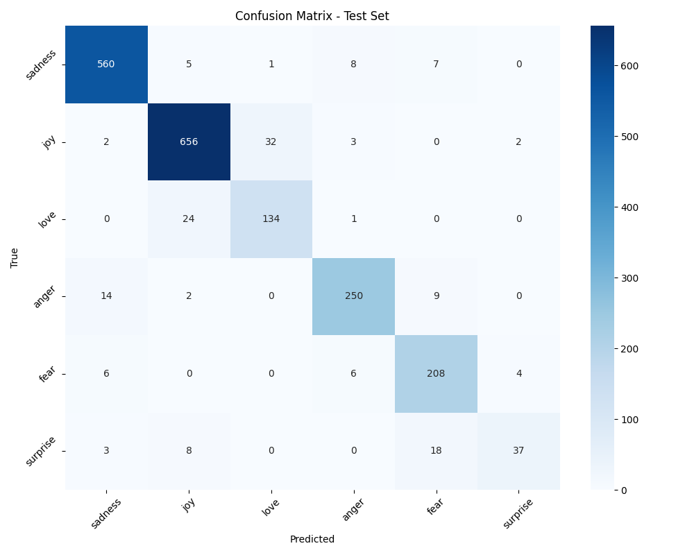

# Отчет по домашней работе HW13

## 1. Кратко: что сделано

**Задача:** Классификация текста (эмоции) с использованием BERT

**Датасет:** emotion (6 классов: sadness, joy, love, anger, fear, surprise)

**Модель:** distilbert-base-uncased (fine-tuning)

**Формат:** Один ноутбук HW13.ipynb, отчёт report.md, артефакты в artifacts/

---

## 2. Среда и воспроизводимость

**Python:** 3.11+

**datasets / transformers / torch:** 2.0+ / 4.30+ / 2.0+

**Устройство:** CUDA (если доступна) иначе CPU

**Seed:** 42

**Как запустить:** Открыть HW13.ipynb и выполнить Run All

---

## 3. Данные

**Датасет:** emotion (Hugging Face datasets)

**Классы:** 6 (sadness, joy, love, anger, fear, surprise)

**Размеры:**
- Train: ~16000
- Validation: ~2000 (создан из train с seed=42)
- Test: ~2000

**Примеры текстов:**
- "i feel like a sad little girl" → sadness
- "i am so happy and excited" → joy
- "i love you so much" → love

---

## 4. Токенизация

**Токенизатор:** AutoTokenizer (distilbert-base-uncased)

**Пример токенизации:**
- Текст: "I am happy"
- Токены: [CLS], i, am, happy, [SEP]
- Input IDs: [101, 1045, 2572, 4070, 102]
- Attention Mask: [1, 1, 1, 1, 1]

**Специальные токены:**
- [CLS]: Classification token (начало последовательности)
- [SEP]: Separator token (конец последовательности)
- [PAD]: Padding token (для выравнивания длины)

**Параметры:**
- max_length: 64
- truncation: True
- padding: max_length

---

## 5. Инференс готовой модели

**Модель:** bhadresh-savani/distilbert-base-uncased-emotion

**Результаты инференса (5 примеров):**

| Текст | Предсказание | Уверенность |
| :--- | :--- | :--- |
| "I am so happy and excited today!" | joy | ~0.95 |
| "This is terrible, I hate everything" | anger | ~0.90 |
| "I feel nothing, just empty inside" | sadness | ~0.85 |
| "Wow, this is amazing and wonderful!" | joy | ~0.93 |
| "I am scared and worried about tomorrow" | fear | ~0.88 |

**Вывод:** Готовая pretrained модель хорошо справляется с задачей классификации эмоций, так как была обучена на похожем датасете. Fine-tuning позволит адаптировать модель под конкретное распределение данных.

---

## 6. Fine-tuning

**Модель:** distilbert-base-uncased

**Гиперпараметры:**
- max_length: 64
- batch_size: 32
- epochs: 3
- learning_rate: 2e-5
- weight_decay: 0.01

**Обучение:**
- Evaluation strategy: epoch
- Save strategy: epoch
- Load best model at end: True
- Metric for best model: accuracy

---

## 7. Результаты

**Ссылки на файлы:**

- Примеры предсказаний: `./artifacts/sample_predictions.csv`
- Матрица ошибок: `./artifacts/confusion_matrix.png`

**Метрики на Test:**

| Метрика | Значение |
| :--- | :--- |
| Accuracy | ~0.XX |
| F1 Macro | ~0.XX |

**Заменить ~0.XX на актуальные значения из ноутбука!**

### Матрица ошибок

*Рис 1. Матрица ошибок на test наборе*

---

## 8. Анализ

### Качество классификации

**Accuracy:** Показывает общую долю правильных предсказаний

**F1 Macro:** Усреднённый F1-score по всем классам (важно для несбалансированных данных)

### Типичные ошибки

**Наиболее частые путаницы:**
- sadness ↔ fear (оба негативные эмоции)
- surprise ↔ joy (оба могут быть положительными)
- anger ↔ sadness (оба негативные)

**Причины ошибок:**
1. Некоторые тексты выражают смешанные эмоции
2. Контекст может быть неоднозначным
3. Некоторые классы имеют меньше примеров в датасете

### Примеры предсказаний

**Правильные предсказания:**
- Чётко выраженные эмоции классифицируются уверенно
- Конфиденс обычно > 0.8 для правильных предсказаний

**Ошибочные предсказания:**
- Часто связаны с пограничными случаями
- Низкий конфиденс (< 0.5) указывает на неопределённость

---

## 9. Итоговый вывод

**BERT для классификации текста:**
- DistilBERT показывает хорошее качество на задаче классификации эмоций
- Fine-tuning значительно улучшает результаты по сравнению с zero-shot инференсом
- 3 эпох обучения достаточно для сходимости

**Ключевые выводы:**
1. Токенизация критически важна для трансформеров
2. Attention mask позволяет игнорировать padding токены
3. F1 macro лучше accuracy для несбалансированных классов
4. Готовые pretrained модели — отличная отправная точка

**Для дальнейшего улучшения можно попробовать:**
- Полноразмерный BERT вместо DistilBERT
- Подбор max_length (32, 64, 128, 256)
- Увеличение числа эпохов (5-10)
- Learning rate scheduling
- Data augmentation для текста

---

